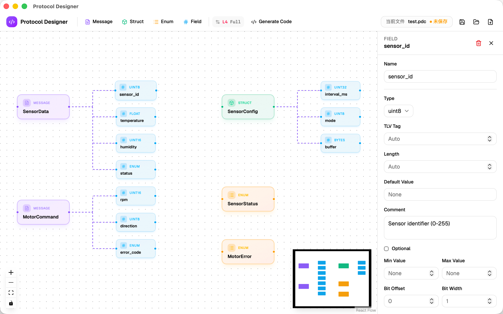
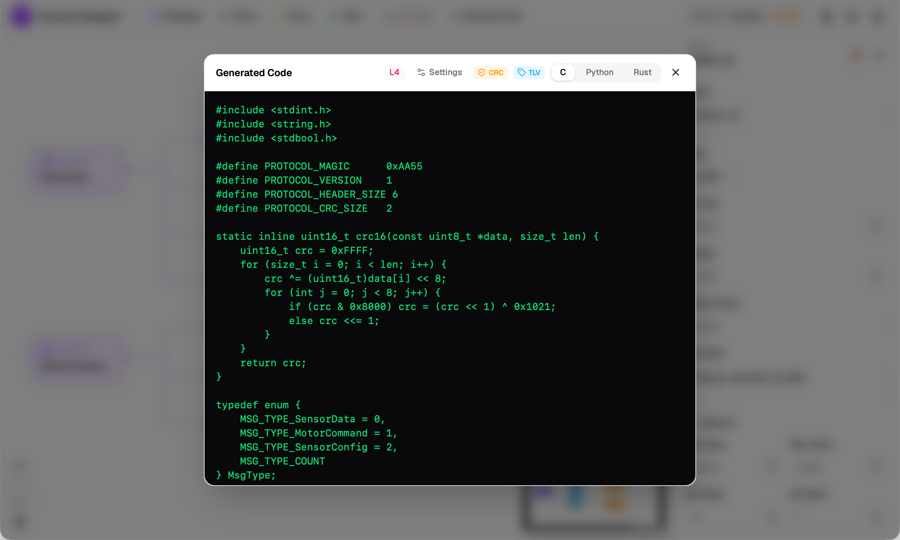

# Protocol Designer

> **🇨🇳 [中文版](./README.zh-CN.md)**

A graph-based **binary communication protocol design tool**. Drag and drop nodes to visually define message structures, field types, enums, and more — then auto-generate serialization/deserialization code in **C / Python / Rust** with a single click.

Supports 5 capability levels (Level 0–4), from raw payloads to full enterprise-grade protocols, with optional modules for CRC, TLV, optional fields, bitfields, and more.





## Features

- **Visual Design** — React Flow based canvas, drag-and-drop nodes to compose protocols
- **Four Node Types** — Message, Struct, Field, Enum
- **5 Protocol Levels**:
  - Level 0: Raw field packing, no header
  - Level 1: Basic header (Magic + MsgType) + Struct/Enum types
  - Level 2: CRC16 checksum, optional field bitmask, range validation
  - Level 3: TLV encoding, version field, forward compatibility
  - Level 4: Bitfields, unions, configurable byte order
- **Multi-language Code Generation** — One-click pack/unpack code for C, Python, and Rust
- **Modular Configuration** — Each feature can be toggled independently
- **Project Persistence** — Save/load `.json` project files

## Tech Stack

| Layer | Technology |
|-------|-----------|
| Frontend | React 19 + TypeScript 6 |
| Build Tool | Vite 8 |
| Canvas Engine | React Flow (@xyflow/react 12) |
| Styling | Tailwind CSS 4 + shadcn/ui |
| State Management | Zustand 5 |
| Desktop Shell | Tauri 2 (Rust) |
| Code Gen | TypeScript (pure functions, no runtime dependencies) |

## Prerequisites

- **Node.js** >= 20
- **Rust** toolchain (`rustc` + `cargo`)
- **System dependencies** (Linux — macOS can compile directly)

```bash
# Fedora
sudo dnf install webkit2gtk4.1-devel libappindicator-gtk3-devel \
  librsvg2-devel patchelf

# Ubuntu / Debian
sudo apt install libwebkit2gtk-4.1-dev build-essential curl wget \
  file libxdo-dev libssl-dev libayatana-appindicator3-dev \
  librsvg2-dev patchelf

# Arch
sudo pacman -S webkit2gtk-4.1 base-devel curl wget file \
  openssl appmenu-gtk-module gtk3 libappindicator-gtk3 \
  librsvg patchelf
```

## Build & Run

```bash
# 1. Clone the repository
git clone <repo-url>
cd ProtocolCreate

# 2. Install frontend dependencies
npm install

# 3. Development mode (hot reload)
npm run tauri dev

# 4. Build release
npm run tauri build
```

Build artifacts are located in `src-tauri/target/release/bundle/`:

| Format | Use Case |
|--------|----------|
| `.deb` | Debian/Ubuntu packages |
| `.rpm` | Fedora/RHEL packages |
| `.AppImage` | Portable executable |

Run the compiled binary directly (no installation needed):

```bash
./src-tauri/target/release/protocolcreate
```

## Usage

### Canvas Operations

| Action | Description |
|--------|-------------|
| Add Node | Click **+Message / +Struct / +Field / +Enum** in the toolbar |
| Connect Nodes | Drag from a node's right handle to another node's left handle |
| Select Node | Click a node; the property panel on the right shows configuration |
| Delete Node | Select and press `Delete` / `Backspace` |
| Move Node | Drag the node's title area |

### Valid Connections

| Source | Target | Result |
|--------|--------|--------|
| Message / Struct | Field | Field is added to the message/struct's field list ✅ |
| Field | Message / Struct | Same as above, reverse drag ✅ |
| Other combinations | — | Connection ignored ❌ |

### Protocol Settings

Click the **Settings** button in the toolbar to configure the protocol level and feature modules:

- **Protocol Level**: Choose level 0–4; corresponding modules are enabled automatically
- **Modules**: Manually toggle features (optional fields, CRC, TLV, etc.)
- **Byte Order** (Level 4+): Little / Big Endian

### Code Generation

Click **Code** in the toolbar → select C / Python / Rust → copy or download the generated code.

### Project Management

- **File → Save / Save As**: Save a `.json` project file
- **File → Open**: Load an existing project
- **File → New**: Create a new project

## Project Structure

```
ProtocolCreate/
├── src/                          # Frontend React source
│   ├── components/
│   │   ├── canvas/               # React Flow canvas
│   │   ├── nodes/                # Custom node components
│   │   ├── panels/               # Property panels
│   │   ├── toolbar/              # Toolbar + settings dialog
│   │   └── ui/                   # shadcn/ui base components
│   ├── lib/codegen/              # Code generators
│   │   ├── c-generator.ts        # C code generator
│   │   ├── python-generator.ts   # Python code generator
│   │   ├── rust-generator.ts     # Rust code generator
│   │   └── shared.ts             # Shared utilities
│   ├── store/                    # Zustand state management
│   └── types/                    # TypeScript type definitions
├── src-tauri/                    # Tauri Rust backend
│   ├── src/
│   │   ├── commands/             # Tauri commands
│   │   ├── file_io/              # File read/write
│   │   ├── generator/            # Rust-side code gen (simplified)
│   │   └── parser/               # Validation logic
│   ├── icons/                    # App icons
│   └── tauri.conf.json           # Tauri configuration
├── public/
│   ├── favicon.svg               # Browser tab icon
│   └── icon-source.svg           # Icon source file
└── package.json
```

## Development

```bash
# Start frontend dev server only (browser preview, no desktop window)
npm run dev

# TypeScript type checking
npx tsc --noEmit

# Lint
npm run lint

# Update app icons (place new icon at public/icon-source.svg first)
npx tauri icon public/icon-source.svg -o src-tauri/icons
```

## License

MIT
